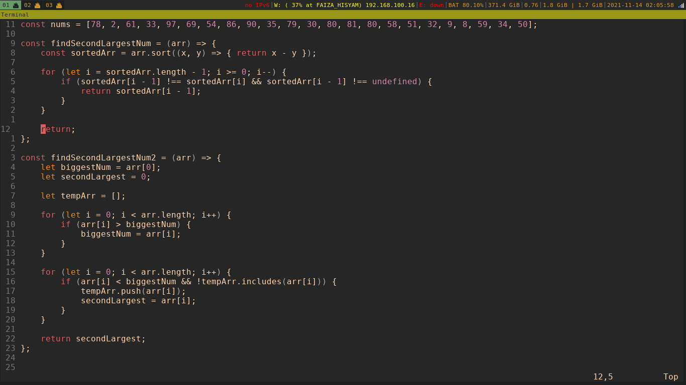
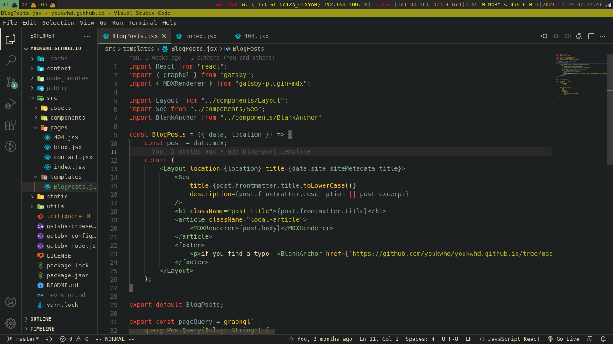

i'm going to use Arch, btw.

i do not own the `.bashrc` file, the origin file should be here: [@moqmar's .bashrc](https://gist.github.com/moqmar/28dde796bb924dd6bfb1eafbe0d265e8) 

> the following repo haven't covered all of the current settings on my desktop yet, i'm currently working on it.

## why even use i3 window manager?
i actually likes dwm more, suckless. the reason why i use i3 is that, dwm feels clunky at the moment, don't know why it feels like so, but i recieve a lot of bugs especially with the visual problems. since i use Ubuntu Focal, i3 and awesome wm is the way to go, it's easy to configure.

i will migrate to dwm after hopping into Arch. 