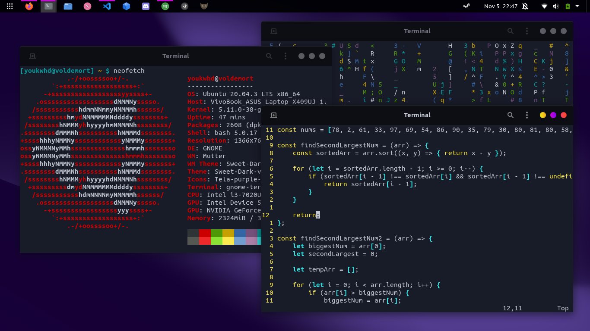

i'm going to use Arch, btw.

i do not own the `.bashrc` file, the origin file should be here: [@moqmar's .bashrc](https://gist.github.com/moqmar/28dde796bb924dd6bfb1eafbe0d265e8) 

> the following repo hasn't covers up all of the current settings on my desktop yet, i'm currently working on it.